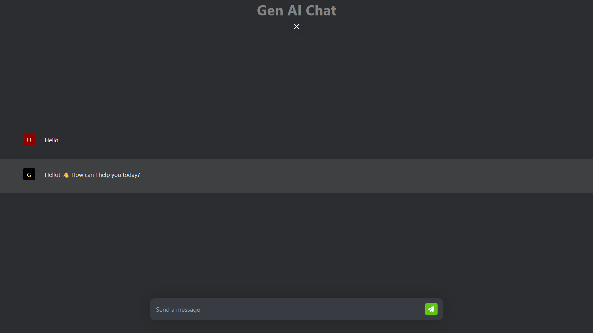
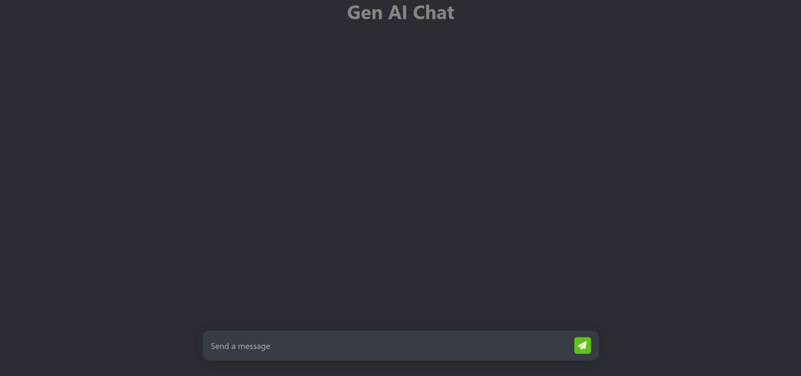
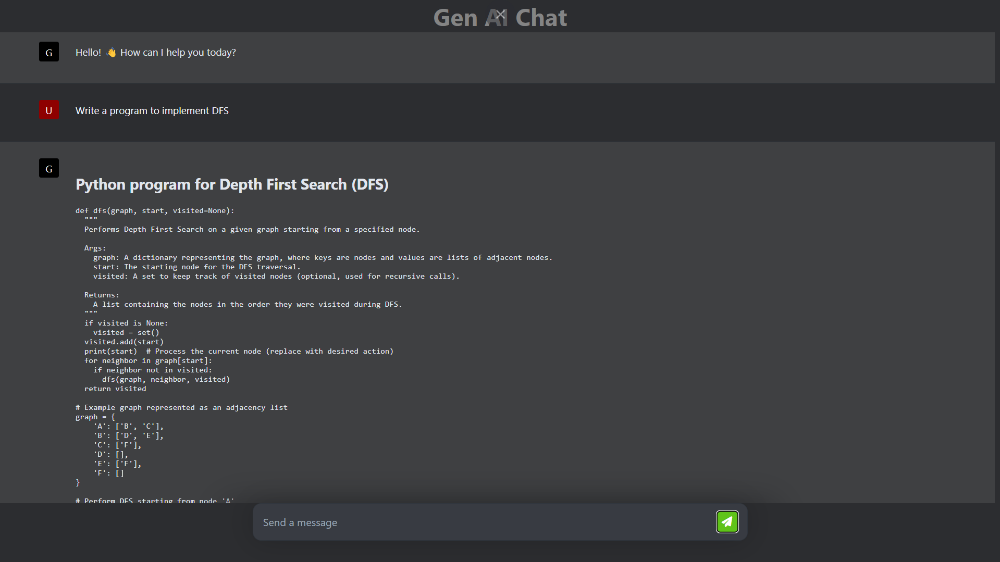

# Naan Mudhalvan Genai Project

This project is a chat interface integrated with an AI model for generating responses. It allows users to interact with the AI model in real-time.

## Demo

You can access the live demo of the project on GitHub Pages: [Naan Mudhalvan Genai](https://genaichat.jarviz.live)

## Screenshots

*This is preview of the ui. I don't have good experience at ui. So, it could feel something awkward*

*This a screenshort with a simple prompt and the respose from the GenAI*

*This is the screen short of GenAI programming.*

## Technologies Used

- HTML
- CSS
- JavaScript
- Marked.js
- Google Generative Language Model (Gemini)

## How to Use

1. Clone this repository to your local machine.
2. Open `index.html` in a web browser.
3. Start chatting with the AI by typing your messages in the input field and pressing Enter.

## Credits

- [Marked.js](https://marked.js.org/)
- [Google Generative Language Model](https://cloud.google.com/generative-language)
  
## License

This project is licensed under the MIT License - see the [LICENSE](LICENSE) file for details.
